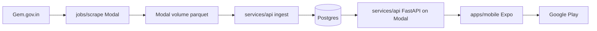

# Architecture

## GeM endpoints (scrape only)

| Step | URL | Method |
|------|-----|--------|
| List contracts | `https://gem.gov.in/view_contracts/contract_details` | POST |
| PDF link | `https://gem.gov.in/view_contracts/sbtCaptcha` | POST |

Session cookie `GEM_COOKIE` is required on Modal workers.

## API

| Endpoint | Purpose |
|----------|---------|
| `GET /health` | Liveness + config flags |
| `GET /search?q=&mode=fts` | Full-text search (default) |
| `GET /contractors/{contract_no}` | Detail card |

## Environment variables

See [.env.example](../.env.example). Production secrets live in Modal secret `gem-contractor-directory-secrets`, not in git.
